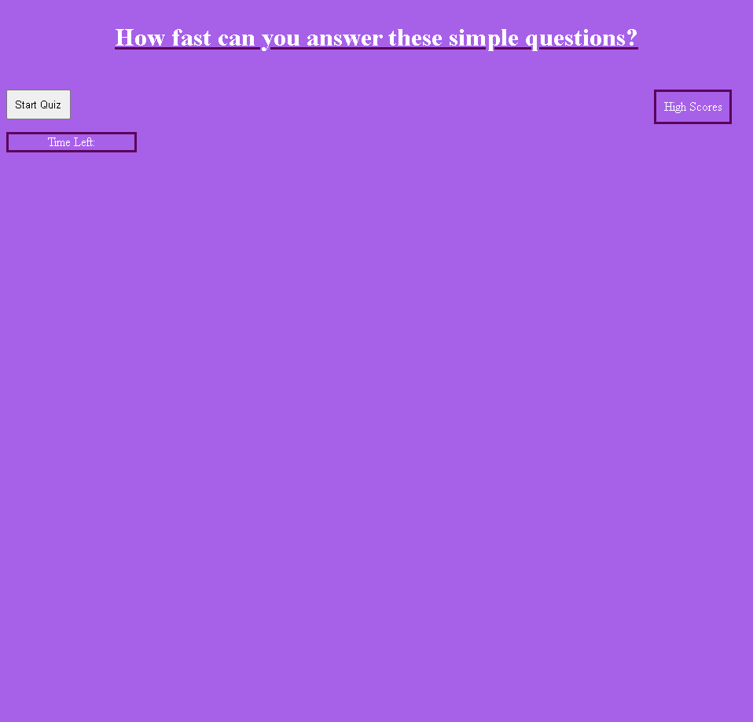

# code-quiz

## Table of Contents
1. [Description](#description)
2. [Visuals](#visuals)
3. [Resources](#resources)

## Description

I've created a quiz by utilizing javascript event listeners, if statements, functions, objects, arrays, etc. This quiz includes a start button, answer choice buttons, a timer, and a message which returns your score after completion.

I added some light CSS to make it more visually appealing, however I have not had enough time to be more thorough with the visual design aspect.

I still must work on troubleshooting my code to store the names and scores both locally and on the page.

I also created a penalty of 5 points (5 seconds) for incorrect answers, and a reward of 5 points for correct answers.

## Visuals

## Resources
[Live Site](https://vmalie3.github.io/code-quiz)

[Repository](https://github.com/vmalie3/code-quiz)